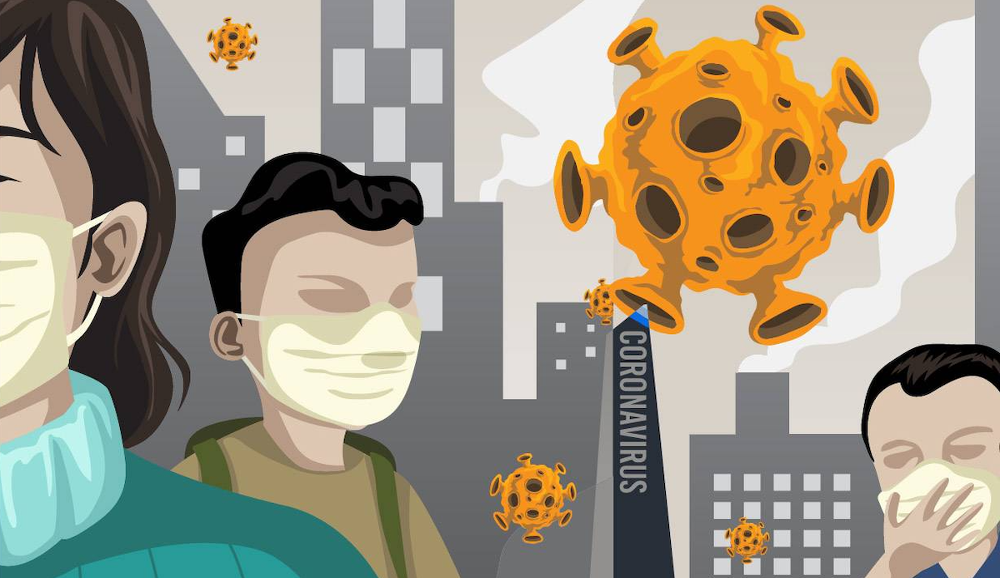

# 如何自助 —— 助人即助己

—— 重大病毒性疫情中如何应对创伤应激障碍

**李笑来**（2020.02）

-----

病毒性传染病疫情从未停止过威胁人类。在这次 2020 年春节前中国武汉新型冠状病毒（[2019-nCoV](https://zh.wikipedia.org/wiki/2019%E6%96%B0%E5%9E%8B%E5%86%A0%E7%8B%80%E7%97%85%E6%AF%92)）爆发之前，2003 年就有过令一代人记忆深刻的 SARS 大爆发。除此之外，还有很多可能随时发生的疫情，比如，禽流感（[Avian Influenza](https://zh.wikipedia.org/wiki/%E7%A6%BD%E6%B5%81%E6%84%9F)）—— H5N2（美国，1983），H5N1（中国广东，1996），H9N2（香港，1999），H7N7（荷兰，2003），H3N2（美国，2006），H7N9（中国上海，2013/03），H10N8（中国江西，2013/12），H7N4（中国江苏，2018/02）…… 

在重大病毒性传染病疫情发生的时候，尤其是该病毒可通过空气传染的时候，每一个人的生命都面临威胁 —— 至少是潜在的威胁。一旦得知自己的生命可能受到威胁，每个人都一样，会因此产生巨大的难以消解的压力；进而有可能仅仅因为压力就会产生很多应激障碍，导致注意力不集中，易怒，失眠；进而会造成最严重的后果之一：自我免疫机能受损 —— 然而，在疫情中我们赖以生存的唯一支撑就是我们自身的免疫机能。

并且，对很多人来说，疫情并非常态 —— 绝大多数人从未预料自己将要面对如此可怕的疫情。于是，恐慌必然在人群中弥漫开来，进而使得每个人的压力在相互影响、相互印证的过程中进一步变大，直至无法承受。

因此，疫情中绝大部分人都需要心理援助。

更为可怕的是，每当重大病毒性传染病疫情发生的时候，医疗资源总是完全没有办法满足正在爆发的需求 —— 对口的医生不够用，药物不够用，设备不够用，床位不够用，隔离设施不够用…… 反正要什么没什么 —— 更不要提足够数量的心理咨询师了。

于是，对每个人来说，出路只有一条：

> 自助 —— 做自己的心理咨询师。

虽然这听起来不大可能，可事实上却并不复杂，甚至可能很简单。

## 1. 如何决定是否读下去

你只需要问自己一个问题，就知道你是否应该认真读下去了：

> 我有没有自己非常关心的人？

如果，除了你自己之外，你谁都不关心，那么，实际上你并没有读下去的必要。

如果，你有你心里格外关心的人，他们出事儿的话，你会非常难过；他们的生命遭受威胁比你自己的生命遭受威胁更令你害怕；你天然有保护他们的冲动，为了他们你甚至宁可放弃自己…… 那么，你就应该认真读下去。

—— 就这么简单。

## 2. 你的角色决定了你的选择

你是船员，你就会理所应当地只做船员该做的事情；你是船长，那你就会自然而然地承担更多的责任，包括保护船员。

再比如，你可能经常听到某个老人讲，说他的儿子 “某一天突然就长大了！” —— 那其实并不是所谓的 “成熟” 了，本质上来看，只不过是 “那个老人眼里的孩子” 突然从某一天开始扮演另外一个角色了而已…… 过去扮演的是小杂碎，现在扮演的是顶天立地的大男人。

在这样特殊的时刻，人人都面临死亡威胁的时候，你的心里有你真正关心的人，你要扮演什么角色？他们的保护者。一旦角色敲定，你的看法、想法和做法就都不一样了，你自己体会一下？你的内心会有一个声音冒出来：他们危险，所以，我要为他们想办法！

在此之前，你很可能只不过是这样的：“危险！怎么办？” —— 虽然没有主语，但，自顾自的世界里，主语只有也只能是 “我自己” 啊！现在不一样了，主语是 “他” 或者 “他们”。

## 3. 伊姆村的故事

1666 年的 8 月份，伊丽莎白·汉考克（Elizabeth Hancock）在短短的 8 天时间里接连埋葬了 7 个人，他们是自己的丈夫，和自己的六个孩子 —— 他们死于黑死病。这种致命的瘟疫，在此之前的四五百年间，在欧洲大陆上间歇性爆发，前后夺走了 1.5 亿人的生命。

伊丽莎白所在的村庄叫伊姆村（Eyam），当时大约有 344 个村民。村里的黑死病是从 1665 年的夏天开始的，最先死掉的是村里的一个裁缝，很快，他家里的其他人也相继染病死亡。后来才知道，这个裁缝从伦敦采购的布料里有跳蚤，这些从伦敦过来的跳蚤把黑死病带到了伊姆村。

没有人不害怕…… 害怕的第一反应当然是逃走。可是，村民们做了一个惊人的决定，他们想要先听听他们所尊重的一位牧师的看法，然后再做决定。这位刚到伊姆村不久仍在忙于建立自己声望的牧师名字叫威廉·蒙佩森（William Monpesson）。更为惊人的是，蒙佩森牧师告诉大家，我们不能跑，因为逃跑即意味着说把疾病继续传播下去。蒙佩森对村民表示，只要自己有一口气在，就会在村里一直陪着大家…… 再次更为惊人的是，绝大多数村民竟然坚忍地接受了蒙佩森牧师的建议，发誓留下来。村民们在村口放了一块大石头，以此为限自我隔离。

今天的我们已经很难想象当年的自我隔离有多么艰难。到了 1666 年中旬，村里死亡人数已经高达 200 人。村里的石匠也去世了，于是，村民们只好自己刻墓碑…… 尸体只能由亲人用绳子远远地套上拖走，礼拜也是露天举行的，以减少疾病的传播…… 瘟疫爆发 14 个月后，黑死病突然消失了。这时候，死亡人数累计达 273 人，村里只剩下 83 个人幸存。

这一次的黑死病爆发，迅速散播欧洲各地，造成人口大量死亡，然而伊姆村周围的城镇却未受感染。伊姆村损失了 3/4 的人口，却成功阻断了感染，保全了英格兰北部数千万人的性命。

这真是个惊人的真实故事。

他们为什么如此坚忍，又，他们是怎样做出如此坚忍的决定的呢？

> 大抵上是因为他们有比自己和自己的生命更为关心的人或事罢。

当年的会议上，蒙帕森牧师说的话大概是这样的：

> “如果我们离开，就等于把疾病再传染给他人。或许，我们可以把这个灾难视为一个礼物，因为它能让我们证明，这世界上的确有善良和真爱。”

疫情过后，蒙佩森牧师也幸存了下来。1669 年，蒙佩森牧师离开伊姆村，前往伊克岭（Eakring, Nottinghamshire）工作。可是，因为他来自疫区，伊克岭的人们并不欢迎他，甚至害怕他，乃至于蒙佩森牧师常年躲在罗浮德公园的一个简陋小棚屋里生活。

有兴趣的同学可以多看看关于伊姆村的文章，比如这篇[英文文章](https://www.bbc.com/news/uk-england-35064071)。

## 4. 恐惧和慌张其实可被分离

在生命受到威胁的时候，没有人不害怕。不仅是害怕，并且应该是极度恐惧。

感到害怕并不丢人 —— 这是正常现象，求生欲是任何一个物种都天然最强烈的欲望。

然而，恐慌却是极其有害的。恐慌只有负面作用没有正面作用，只能是消极的恐慌，会使人做出不理性的选择，进一步恶化早已经存在且不可回避的危险。

恐慌是什么？顾名思义，恐慌就是恐惧引发的慌张。

其实把恐惧和慌张分离开来是很容易的 —— 比绝大多数人以为的容易得多。

你一定有过在电影院里看恐怖片的经历。恐怖片的导演、编剧、摄影、主演以及配角，他们整套班子都在有过之而无不及地穷尽一切手段让你感受到恐惧，因为只有这样，他们才算是成功。你坐在那里，一次又一次地被惊吓，一次又一次地真真切切地感受到恐惧……

然而，重点在于，你竟然不会慌张！

你看，你事实上已经有过把恐惧和慌张分离开来的实战经验 —— 只是你没想到而已。

从心理学的专业角度去讲的话，是这样的：

> 坐在电影院里看恐怖片的时候，是你的清醒意识（Conscious）在感受恐惧，但，你的潜意识（Subconscious）实际上并不恐惧 —— 所以你不慌张。

1896 年，世界上第一部电影（当然是无声电影），火车进站（***The Arrival of the Mail Train***）首映的时候，观众被直冲着他们而来的真人大小*列车*的移动画面吓得惊慌失措，人们尖叫着跑到放映室的后面。

他们的恐惧和慌张为什么没有被分开呢？

这就要解释一下我们大脑中潜意识的工作原理才能说得清楚。

## 5. 潜意识的基础工作原理

我们现在最熟悉的电子设备很可能只能是手机了。我们的手机有起码两组摄像头，前置一组，后置一组。

我们的意识就好像是手机一样，有两组摄像头在随时在记录我们所遭遇的一切。你的清醒意识就好像是前置摄像头，我们把它称作摄像头A，而你的潜意识就好像另外一个摄像头，我们把它称作摄像头 B。

这两个摄像头的区别在于，摄像头 A 焦距很长，所以清晰范围很小，拍摄角度也很小。因为我们的清醒意识是要对已获得数据进行及时处理的，所以，它也确实处理不了太多的信息。而摄像头 B 是全景摄像头，焦距很短，所以，事实上清晰范围极大，拍摄角度也是 360 无死角的…… 因为，我们的潜意识不负责处理信息，它只负责记录，不停地记录，不做任何处理。

你的潜意识不停地记录，所以它一定需要一块很大很大的硬盘才能把那些经年累月拍下来的视频保存下来。虽然它从不做实际思考，也不做实际判断，但，它有个很容易理解的机制，就是重复者优先。也就是说，若是某一个模式反复发生，那么它就会把这个模式放到最容易调出的地方。

看到有什么东西迎面冲过来，不需要你的清醒意识思考，你的潜意识会让你立刻跳起来逃离 —— 这是因为你和你的祖先重复过很多次的经历，所以，你的潜意识早就为这种情况建立了快捷方式，不假思索地采取正确行动，这多方便啊！

在 1896 年去电影院看火车进站的观众，就是这样被他们的潜意识直接驱动，而后逃离电影院的。

那为什么你现在反应没那么激烈了呢？因为你坐在电影院看迎面冲过来什么东西的次数已经足够多了，乃至于你的潜意识早就为这种情况建立了新的快捷方式，所以，即便你仍然会被刺激到，你的身体甚至可能会不由自主地猛烈晃一下，但，“惊慌失措地跑掉”，在你身上基本上不太可能发生了。

接下来的结论就很自然了：

> 你的潜意识是可以被改变的……

不仅如此，既然它是可以被改变的，为什么不找找方案，把它往更好、更有效的方向上改变呢？即，你的潜意识是可被训练的。

## 6. 恐慌的根源是什么？

恐惧和慌张，并不见得总是联系在一起。但，若是你真的恐慌了，那意味着什么呢？恐慌的根源究竟是什么呢？

清醒意识和潜意识的关系，有点像老板和秘书之间的关系。清醒意识就好像是老板，而潜意识就好像是老板的秘书 —— 老板需要什么，秘书就要提供支持……

老板感到恐惧了，秘书却拿不出预案 —— 老板就慌了…… 就这么简单。

有统计表明，人们因需要上台演讲产生的恐慌远远大于因思考死亡而带来的恐慌。为什么？因为上台演讲对绝大多数人来说是前所未有的经历，所以，潜意识，即，你这个老板的秘书没有任何预案，因为根本就没有任何重复的经历，别说重复了，连第一次都没有过，怎么可能不是最恐慌？

平日里死亡显得没那么可怕，因为你的秘书知道死亡是很久以后的事…… 可当重大病毒性疫情发生的时候，你这是前所未有的第一次感受到如此近距离的死亡，而你的秘书当然没有任何预案，所以，你自然而然地开始恐慌。

所以你就明白了，所谓的冷静，不是凭空而来的。在绝大多数情况下，所谓的冷静，总是以丰富的经验为前提。处变不惊从来都不是天生的特质，恰恰相反，它只能来自于积累。

从我自己的角度来看也是一样的。若是当年没有在北京经历过 2003 年的 SARS 疫情，现在的我很可能不太容易像现在这样情绪相对比较稳定。

## 7. 潜意识的好玩之处

潜意识只负责记录，它没有思考能力，没有分辨能力，它最多只能识别重复。

于是，出现了一个格外好玩的现象：

> 秘书无法分辨老板是正在亲身经历，还是老板正在生动地想象……

对秘书来说，无论是亲身经历，还是生动的想象，都是一样的，记录下来就是了。记着记着发现重复的模式，做快捷方式就好了……

现在这个技巧在很多领域都是常识。比如，国际比赛的运动员就普遍使用这种技巧。他们会在比赛之前反复冥想，细致地想象在比赛场上的每一个细节，然后想象自己完美发挥的样子，甚至连最终拿下冠军之后的呼吸方式都要 “演练” 很多遍…… 他们会调用所有的感官，想象嗅觉，想象视觉，想象听觉，想象触觉，甚至会想象现场汗水的味道…… 想象越是逼真、越是细节丰富，“秘书” 越是信以为真。这么做的最明显效果就是他们上场之后全无紧张，非常轻松，因为无论遇到任何情况，“秘书” 都有足够的预案。

所以，看电影并不仅仅是娱乐而已。也许你看过不少灾难片，但很可能你只是杀时间而已。有些人看过灾难片之后，会不由自主地想，如果我是主角，我会怎么做？如果我遇到类似的情况，谁对我最重要，最高的优先级到底是什么？故事里谁的下场不好是因为他的选择错误？如果他换一种选择会是怎样的解决？如果我是他，我会不会做出同样的选择？想得越细，你的 “秘书”（即，你的潜意识）就越会信以为真 —— 于是，你的秘书就相对于他人的秘书多了一些 “预案”；于是，相对来看，类似情形发生的时候，你更容易相对冷静。

以下是一些与疫情有关的电影电视剧，随便挑几个看看：

> * 恐怖地带 (1995)
> * 惊变28天 (2002)
> * 天外来菌 (2008)
> * 嗜血破晓 (2009)
> * 传染病 (2011)
> * 流感 (2013)
> * 末日浩劫 (2013)
> * 复生 (2013)
> * 平常的心 (2014)
> * 灭绝 (2015)
> * 隔离死城 (2016)
> * 血疫（2019）

## 8. 恐慌的即时应对策略

恐慌发生的时候，本质上只不过是你这个老板的秘书没有预案而已。

所以，你要做的最直接最简单的事情，就是告诉你的 “秘书”：

> 行了行了，我知道你没招了…… 你先别闹，让我想想办法。

潜意识这个秘书的唯一核心任务就是支持你躲避危险。当它无法支持你的时候，它就胡搞瞎搞，给你调出一切它能调出的过往记录 —— 这就是为什么在慌乱之中你会有各种稀奇古怪不合情不合理甚至干脆算得上是邪恶的念头。

有人建议你对自己说，“我要冷静！”

这种粗暴的建议通常是没有效果的。

就好像之前讲过的，潜意识是无法分辨你的实际经历和你的想象一样，你的潜意识无法分辨你的实际感受。如果你想要你的 “秘书” 安静下来，不要胡闹，最有效的方法是故意让身体放松下来。

把你的身体舒展开来，把你的呼吸速度放慢，或者，把你的目光聚焦到远处，甚至找一个宽阔的空间都有帮助。做出你在安全区域舒适状态下经常做的动作，你的潜意识就会平静下来，因为它相信你已经处于安全和舒适的状态。它就又开始有条不紊按部就班地工作了。

于是，你这个老板终于可以集中精力琢磨应对方案了。

## 9. 以理服己才是正确的选择

人们总觉得应该以理服人 —— 结果呢？总是以失败告终。

事实上，最应该以理相服的，是自己啊！理性对待任何人都挺困难的，既然如此，为什么不理性对待自己呢？这才是对自己真的好啊！

自己跟自己说话，在很长一段时间里都被认为是 “精神病症状”。可事实上，我们的大脑的确就是如此工作的，你的脑子里有清醒意识，还有另外一个工作方式并不相同的潜意识，所以，你的脑子里总是有不止一个声音，不是吗？

（事实上，潜意识中，也有两个部分，一部分产生直觉，另外一部分产生情绪。这就三个声音了，不是吗？柏拉图的类比是，一个车夫，一匹黑马，一匹白马；西格蒙德·弗洛伊德的说法是，本我，自我，和超我。）

所以，要经常跟自己对话，一问一答，有助于厘清思路：

> * 我这么想是对的吗？
> * 我的判断依据都有哪些？合理吗？靠谱吗？
> * 还有什么是我没有想到的？
> * 若是我这么做了，都有哪些后果？
> * 有没有什么后果是我无法承受的？
> * 有没有可能出现意外？
> * 最坏的情况是什么？如若发生我应该怎么办？

日常生活中从未如此 “喃喃自语” 的人，基本上只能是 “大脑简单” 的那种罢。

## 10. 灾难面前不要参与群辩

灾难发生的时候，绝大多数人是被他们的 “秘书” 所驱动的 —— 你只要想象一下一个科研大会的参会者全都是秘书的话会是怎样的景象就明白了。

每次重大疫情发生的时候，“理论” 的声音总是突然间嘈杂起来，这就好像股市里只有在股灾发生的时候人们才开始认真对待且严肃讨论 “价值投资” 一样 —— 他们不是突然理性起来了，实际上他们只是突然不知道怎么办了而已。

如果你想要保持冷静，那么就尽量不要参与关于疫情的种种 “原本应该……” 和 “本来可以……” 之类的争论，更不要参与网络上的群辩。这种争论，从来都不会有结果的，至少从来都不可能很快有结果的 —— 可是，你处于什么状态啊？兵临城下。

历史上所有的重大疫情和现在以及未来的所有重大疫情一样，每个群体，每个国家，甚至整个人类都一样，总是反应过慢，应对不足，进展缓慢…… 

疫情永远不可能被恰当地对待 —— 天天草木皆兵吧？实际成本太高，高到完全无法承受；稍一不留神就爆发，实际成本同样无法承受…… 这就是现实。

首先，如若灾难像这一次一样威胁到整个人类（美国紧急撤侨，随后又禁航，是历史上从未见到过的举措），事实上是没有任何人有能力负责的 —— 追责，怎么追？追到了又怎样？难道追责能缓解疫情吗？

更为重要的是，当我们身处所有人共同面对的死亡威胁之时，过去、现在、将来之中，最不值得关注的是过去，注意力最值得的用处在当下，至于未来，是活下去才能见到的东西。

还记得吗？最值得你关心的，并不仅仅是你自己，还有你所关心的人和事 —— 否则，你也不会读到这里。

为了你所关心的那个人或者那些人，你必须把所有的注意力放到最重要的地方：

> 你自己的安全 —— 生理安全和心理安全。

你必须先保证你自己的健康和安全，你才有可能保护你所关心的人。

## 11. 新型冠状病毒的一些事实

以下是一些关于新型冠状病毒的基本事实：

1. 新型冠状病毒可通过空气传染，也可通过皮肤接触传；务必要注意回避呼吸道飞沫，以及带有病毒的分泌物。
2. 常见症状包括发热、四肢乏力、干咳、以及呼吸困难。但，被传染者不一定发烧，甚至可能没有症状。
3. 新型冠状病毒被认为对人群普遍易感。老人感染上后病情会相对严重。有[研究](https://c.m.163.com/news/a/F3P7O9QR0001899O.html)表明，女性相比男性在相同的环境下感染人数更少。
4. 根据统计数据，目前每个感染者大约能够继续感染 3～5 个人。（这就是所谓的 R0 值，R naught）。
5. 针对新型冠状病毒，目前尚无有效治疗的药物与疫苗。
6. 病毒在传播过程中会不断变异。
7. 与任何重大病毒性传染病疫情一样，隔离是唯一可能有效的抗争方案。

现在你可以通过以下链接查看疫情数据地图：

> * [2019-nCoV Global Cases  (数据来自 Johns Hopkins CSSE)](https://gisanddata.maps.arcgis.com/apps/opsdashboard/index.html#/bda7594740fd40299423467b48e9ecf6)
> * [新型冠状病毒疫情实时动态（山月版，数据来自丁香园）](https://ncov.shanyue.tech)

## 12. 坏消息中的好消息

这是病毒性传染病的普遍规律：

> 一般来说，毒性大的病毒传染能力弱，反过来，传染能力强的毒性小。

这一次新型冠状病毒，传染能力极强，**R0** （读作 “R naught”）值约在 *3～5* 之间 —— 即，平均来看，新型冠状病毒在传染上一个人之后，此人能再传染三到五人。

新型冠状病毒的传染能力极强，即意味着说，它的毒性相对较低，直接结果就是染病后的死亡率相对较低。以下是近几年全球性的传染病的死亡率统计。

|  病毒名称   | 年份 | 感染人数 | 死亡人数 | 死亡率 | 波及国家数量 |
| :---------: | :--: | :------: | :------: | :----: | :----------: |
|   Ebola**   | 1976 |  33,577  |  13,562  | 40.4%  |      9       |
|    Nipah    | 1998 |   513    |   398    | 77.6%  |      2       |
|    SARS     | 2003 |  8,906   |   774    |  9.6%  |      29      |
|    MERS*    | 2013 |  2,494   |   858    | 34.4%  |      28      |
| 2019-nCoV** | 2020 |  9,812   |   213    |  2.2%  |      23      |

> \* 截至 2019 年 11 月；\** 截至2020 年 1 月 31 日
>
> 数据来源：CDC，世界卫生组织，新英格兰医药杂志；参见：[Business Insider](https://www.businessinsider.com/china-virus-everything-we-know-deadly-2019-ncov-wuhan-spread-2020-1#the-total-number-of-cases-internationally-has-surpassed-that-of-the-entire-sars-outbreak-8)

与 2003 年中国经历的 SARS 的死亡率 *9.6%* 相比，目前新型冠状病毒的死亡率相对小很多，**只有 2.2%**…… 

## 13. 避免成为密切接触者

与病例（疑似和确诊病例）发病后有如下接触情形之一者，被定义为“密切接触者”：

> 1. 与病例共同居住、学习、工作，或有其他密切接触的人员。
> 2. 诊疗、护理、探视病例的医护人员、家属或其他与病例有类似近距离接触的人员。
> 3. 与病例乘坐同一交通工具并有近距离接触的人员。
> 4. 现场调查人员调查后经评估认为符合密切接触者条件的人员。

人民日报推出了一个工具，可以用来查询你自己是否曾经与当前已被确诊的患者同行：

> [新型冠状病毒感染的肺炎确诊患者同行程查询工具](https://h5.peopleapp.com/txcx/index.html)

**一旦发现自己是密切接触者（无论是被通知，还是自己经过查询获知），唯一合理的决策只有 “自我隔离”。**

首先，密切接触者并不一定是感染者。被新型冠状病毒（2019-nCoV）传染上之后，可能有症状，也可能无症状，潜伏期可长达两周（14 天）。所以，密切接触者无论有没有症状都只有一半的概率的确被传染上。

|        | 染上                                       | 未被传染         |
| ------ | ------------------------------------------ | ---------------- |
| 有症状 | 事实上也有一半的概率自我痊愈               | 可能只是普通流感 |
| 无症状 | 可能尚处于潜伏期，同样有一半的概率自我痊愈 | 彻底没有染上     |

即便是你真的已经被感染，也实际上有一定的概率能够自我痊愈 —— 人类的免疫系统依然是非常有效的。另外，新型冠状病毒的死亡率远远低于 50%。

所以，从概率角度出发，自我隔离永远应该是第一选择，**直接去医院问诊，肯定不是最优策略。**

你必须想清楚：**在疫情发展的过程中，医院是最大的传染源。** 如果你实际上并没有被传染上，很可能会因为去了医院而反倒变成真正的感染者。

即便是你真的被传染了，你也应该知道，事实上，作为二代、甚至三代感染者，身上的病毒很可能已经有所削弱，有没有医生都一样，最终你只能靠你自身的免疫力去战胜它 —— 即便是你去了医院，被收治了之后，医生也根本无法做到马上将你治愈，而是尽力延长你的生命（痛苦）。

**要想尽一切办法尽量避免成为密切接触者。**

虽然在中国这么说必然引发争议，甚至可能招来横祸，但，**良知告诉我必须把这句话说出来**：

> **中药根本不适用于病毒性传染病**

2003 年的时候声称对 SARS 有效的板蓝根冲剂，2020 年声称对 2019-nCoV 有效的双黄连口服液，都是铁板钉钉的扯淡。坏蛋骗傻子的游戏，竟然总是可以成功，令人无语。

2020 年 1 月 31 日晚间，全国上下有很多人跑到药店门口挤着排队，抢购双黄连口服液。他们的选择令人担忧 —— 在此之前他们中的绝大多数人尚未被感染，这下可好，一夜之间个个都变成了 “密切接触者” 而又不自知…… 而后，他们散去，回到各自家中，再把 “密切接触者人数” 扩大三五倍。他们的家人实在是太可怜了！不得不与这些人接触的那些人更可怜！

## 14. 家中的有效隔离

要避免家里成为封闭空间，一定要定时通风。

回家第一件事就是洗手 —— 最好在门口放置消毒免洗手液。

在门口脱下外套。

每人一套毛巾，不要混用。

每人一套餐具，不要混用，尽管麻烦，尽量使用公筷、公勺。

养成咳嗽或者打喷嚏时用手臂捂嘴的习惯。

揉眼睛一定要用纸巾，而不是直接用手。

不要在家里过多喷洒消毒水，消毒水过敏的症状和流感以及肺炎几乎一模一样，甚至连呼吸困难症状都相同。

## 15. 练习和颜悦色的说话方式

好像所有人的感受都相同：

> 最不听话的就是家人……

好像永远如此。

可实际情况是，绝大多数人一生都未学会对待家人应该且只应该使用和颜悦色的说话方式。

当我们伤心、愤怒、紧张、激动的时候，我们口腔与声带的工作方式都会发生相应的变化，声调提高，声音会变得刺耳，语速加快 —— 所有这些的作用，只有一个，使对方的潜意识紧张起来，迅速寻找应对方式……

你必须时刻提醒自己：

> 只有当我们和颜悦色地说话的时候，对方才是老板，否则永远只能跟对方的秘书对抗。

对方的秘书懂个屁啊！智商大约相当于七八岁的小屁孩而已。可你却不知道，所以越想越生气，于是进入多重恶性循环。

平时要勤练习，无论想说什么的时候，只要对方是家人，那么，就要在脑子里把要说的话，用和颜悦色的方式演练至少一遍。

觉得自己干脆做不到的时候，不要说话。

比如，你的配偶死活不肯出门戴口罩，他就觉得无所谓…… 跟他理论是没用的，尤其是用语言理论是断然无用的。那怎么办？挡在门口，递给他口罩，等。等他戴好，你再让开。一个字都不用说。反正，不要跟他的秘书对话就对了。

再举个例子，你知道中药不管用，但家里的老人非要半夜出门排队抢购双黄连口服液怎么办？

还是一样的，不要尝试用语言说服对方。告诉他你已经通过网购帮他们买好了，耐心等等…… 哪怕是撒谎，也比他们跑出去排队成为密切接触者强，是不是？一觉醒来，等他们的“老板”上班了，秘书不闹了，再和颜悦色地告诉他们你为什么撒谎了，也是很好的啊！

## 16. 假期结束了怎么办

假期结束了，需要出去工作，不可能再躲在家里了…… 面对的危险更大了，是吧？

讲大道理是没用的。这里，我只想拷贝粘贴一段我和我的社群中某位成员的对话：

> > 笑来老师您好，我是一名国家公务人员，对于这次疫情，您那天讲课讲到恐惧不恐慌时，因为还没正式上班，待在家里不出门，我还没太有紧张感，但今天我值班，因为单位要购置防护物资，要跟别人面对面打交道，收物资然后再分发，缺货的还要去超市再找，心里开始很郁闷，因为我们当地一个超市刚有一个卖菜的服务人员被确诊，当开车在路上看到路边商店、饭店关门，三三两两的车行驶在宽阔的马路上只有路灯发着清冷的光时，我感到好孤独无助，今天只是个开始，等正常每天上班后真有紧急情况，我们必须往前冲，还不知疫情啥时候结束，第一次感到病毒、死亡离我这么近，我还有孩子，笑来老师，我除了尽可能做好防护，我该怎么办？
>
> 很多人都面临同样的问题。因为我们现在面临的是对所有人都有生命威胁的病毒。 你问问你自己，如果你逃回去，躲在家里再也不出来，那么，这个决定是如何定义你的人格的？你愿意以那样的人格继续生活一辈子吗？ 其实，现在很多人都没反应过来：如果从此之后必须“苟且”，那么其实生不如死。尽可能做好防护，积极向上地活着。
>
> > 谢谢老师！
> >
> > 现在我感觉到了我内在的那份力量，笑来老师您的话总是能砸进我的心里，给我智慧，给我力量！

## 17. 助人即助己

我有一个几千人的社群。

有一天，我在社群里讲课，告诉大家如何在疫情中做好自己的心理建设。结束的时候，我告诉大家，我虽然不是医生，虽然不是疫情专家，但，我是个很好的心理咨询师，非常擅长做各种心理疏导。现在疫情这么严重，所有人都有或多或少的创伤应激障碍，如果有人觉得需要心理疏导，可以跟我私聊。

几天下来，像上一节里那样的对话，前前后后已经过千条了……

我为什么会愿意在这样的事情上耗费时间精力？原因很简单，因为我很清楚，在这样的时候，助人即助己。

许多年前我就明白这个道理。许多年前，我发现自己特别需要被人鼓励 —— 谁不是如此呢？但，真的没有任何人鼓励我…… 真的很可怜！那怎么办呢？我的解决方法就是 “开始无时不刻地鼓励任何人”。 不停地鼓励别人，总是鼓励别人的结果就是，自己变成了不需要鼓励的人 —— 事实上，每次鼓励他人的过程都是在鼓励自己啊！尤其是当我看到被鼓励的人发生变化的时候，对自己是真正的鼓励，更大的鼓励啊！

疫情刚刚爆发的时候，我自己也马上开始出现了 “创伤应激障碍” 的症状，最典型的比如，注意难以集中 —— 连续四五天，一个字都写不出来。如何自救？很简单啊，想办法救别人啊！然后我的 “秘书” 就开始给我各种支持，因为这样的事情我已经做过无数遍了，所以它有不止一个 “预案”。

我开始看书、整理资料，接受社群成员的问询，能马上应对的就马上应对，不能马上应对的就告诉对方，“容我仔细想想”……

很快，我就进入了 “**现实生活中我有能力、我有责任、我有希望**” 的状态 —— 毕竟，我的角色很轻松地唤醒了我…… 你想啊，我毕竟是一个几千人社群的群主啊！

## 18. 保护自己的免疫机能

即便是这次的疫情最终平息，另外一种病毒的疫情还是会再次发生。在任何病毒性疫情面前，能保护我们的只有我们自己的免疫机能完善 —— 面对细菌，现代医学还是有一些办法的，可面对病毒，我们几乎总是束手无策。

保证自我免疫机能有效的方式，对普通人来说，其实相当简单，却事实上不见得容易做到：

> * 每日适度运动（当前情况下就是室内运动每天至少出一次汗）
> * 每日保证充足睡眠（如有必要就服用一些睡眠辅助药物，比如褪黑素）

更为重要的是，避免过度焦虑。请牢记：

> **过度焦虑是最损伤免疫机能的！**

尽管看起来有点极端，可事实上你最好听从以下建议：

> * 干脆关掉电视（或者，只看电影和剧集）
> * 短期关掉微信朋友圈
> * 短期卸载微博、抖音

**每日查看疫情发展状况最多一次。** 

尤其不要让家里的孩子过度暴露在各种疫情信息（绝大多数是令人害怕担心的重复信息）之中，他们更为脆弱，更需要保护，尤其是心理保护。如果家中有孩子，那么，大人更应该规避时时刻刻讨论疫情。每天最多开一次 “通气会”。

尤其地，家中若是有糖尿病患者的话，必须辅助并监督他控制好血糖 —— 持续高血糖会直接引发免疫机能毁损。

## 19. 学会嬉皮笑脸地生活

人们为什么总是在关键时刻 “掉链子” 呢？很可能是因为人们对待重大问题的时候都会非常严肃，甚至干脆 “不得随意发声”。

比如，面对死亡，人们就有很多的禁忌。避讳谈论，甚至干脆避讳提及…… 不小心提到了，为了辟邪还要 “呸呸呸” 至少三下…… 这种做法真的对吗？有没有不合理的地方？如果有，害处在哪里？

有一项调查发现，绝大多数在空难事件当中幸存的飞行员都有共同的特征，就是，他们的嘴很臭，啥都敢说，经常讲各种关于空难的笑话 —— 而绝大多数人是不会这么做的，觉得那样不吉利。然而，在灾难发生的那一刻，只有这些平常拿空难开了无数次玩笑的人才有可能正常思考，不受慌张的潜意识的影响。而那些平日里连提都不敢提的人，到了灾难发生的时候，直接进入 “战斗、逃跑、冻僵” 这三种应激状态中最差的一种， “冻僵”。

多项调查表明，人群当中至少有 85% 甚至更高比例的人在遇到极端危险的情况直接进入 “冻僵” 状态……

而这个比例也是相对符合现实生活状态的，绝大多数人根本就不敢讨论禁忌话题，只有少数人总是嬉皮笑脸地对待它们。用我们东北话讲，就是 “皮愣嘎叽的” —— 换个角度看，这其实是心理强大的一种表现。

## 20. 危险不应改变你的价值观

一个人自身的状况会极大地影响他对世界的感知。

我被发现糖尿病之后的一段时间里，就体会过这种情况。当时我必须住院治疗观察，整个一层糖尿病患者里，我是最年轻的。我反复听到的一句话就是，“这么年轻就得糖尿病了？” 更恼人的还有比如，“咋这么年轻却这么严重？”

你可以想象，在那一小段时间里，我的心情有多么糟糕，内心有多么压抑。在这种状态下，你知道我对同样的世界产生的感知是什么样的吗？

> 连身材曼妙的美女护士在我眼里都是面目可憎的！

—— 甚至能到这个地步。

重大疫情发生了，这的确是坏事。但，除此之外，这个世界的其他部分并没有突然发生好与坏的巨大变化。原来人群中有多少比例的好人，现在还是多少比例，并没有发生变化。原来人群当中有多少比例的坏人，现在还是多少比例，并没有发生变化。

你可能觉得骗子突然多了起来，其实并没有，原来有多少骗子，现在还是那些骗子，只不过，灾难发生的时候，骗子们突然找到了机会而已……

之前有多少比例的人持有双重标准，那么，现在依然是有多少比例的人持有双重标准，只不过在重大疫情面前，他们的双重标准暴露无遗而已……

在高密度的坏消息面前，你会不由自主地低估好消息的价值。

这个假期你天天宅在家里，伸手虽然可见五指，抬眼却看不到任何其他人，于是你可能会忽略大量的好人。依然在清洁城市的环卫工人，每天奔波在路上的快递小哥，比平时忙了一百倍的警务人员…… 更不用提大量 “逆行” 的医务人员 —— 多关注一下他们吧！骗子、小偷、坏蛋混蛋，根本就不值得你关注 —— 至少现在。

## 21. 希望才是最大的支撑

人们以为的坚强，其实并不存在。

没有不害怕的英雄，没有不自私的公仆，没有无缺点的父母…… 任何人都有一大堆的问题。

我们终生都在努力克服自己的缺点，时时刻刻都在与自己的阴暗面作斗争，并且还经常失败 —— 这才是生活的普遍真相。

世界那么不完美，我们如此多的缺陷，为什么还要津津有味地活着？

因为不管是一厢情愿也好，不切实际也罢，我们总是相信明天会更好 —— 这就是动力的来源。若是没有了希望，一切都没有意义。

多年来，我一直是自己的心理咨询师，自己的心理援助师。实在无能为力的时候，我就跑去当别人的心理咨询师、心理援助师…… 每一次基本上都是相当管用的。

然而，总是有更为艰难的时刻，比如现在，地球上的每一个人都面临生命威胁的时候。那怎么办？终极的手段只能是诉诸于希望。比如，简单点，我希望这些文字能够帮助更多人。

再比如，关于这次疫情，我相信它一定会过去的。新型冠状病毒不会杀死所有人 —— 它也要利己，杀光了所有人，它就没地方呆了，它也需要宿主。所以，病毒在传染人的过程中，不断变异，实际上是为了给自己和宿主之间建立一种平衡关系…… 这是传染病常识，病毒在传染的过程中所谓的毒性一定会慢慢削弱。所以，疫情一定会过去的。

比较有趣的是，历史上从来都没有不一样的时候，每次疫情大爆发之后，随之而来的是各方面的复兴，不仅是经济复兴，通常还会伴随着文化复兴 —— 你说这不是希望这是什么？

## 结语

做自己的心理咨询师，并不难，起码入门并不难。

在糟糕的闪念出现之时，你第一个要问的是，这是老板在讲话？还是秘书在讲话？如此这般，你会发现自己一下子就清醒过来了。因为你已经知道那秘书的工作原理，你也知道如何与它沟通。

能给自己做咨询师之后，你会发现你其实可以为你所关心的人做心理咨询心理援助了。因为你会发现你现在是真正能做到 “有效倾听” 了 —— 当你发现自己能够分辨自己究竟是在与老板打交道还是与秘书打交道的那一瞬间，你几乎与大师无异了，的确有一点神奇。

能力伴随着责任。你拥有了新的角色，你开始重视自己的选择如何定义自己的人格。你有了比自己更为重要的人或事…… 这一瞬间，你的世界也会随之而变 —— 更为重要的是，你开始创造一个新的世界，值得拭目以待的新世界。

灾难终会发生，可若是没有最坏的时刻，怎么会有最好的时光？关键在于，你不仅开始自己制造希望，你还会因为自己扮演保护者的角色，所以会不由自主地不断传播希望。

没有理由不相信，你自然而然地会变成一个更好的你。

----

2020/02/02 凌晨，于北京

-----

另外，2020 年，我会每天抽出一点时间，充当免费的心理援助师。

你可以在 [Mixin Messenger](https://mixin.one/messenger) 上找到我，我的 ID 是 *26806*
